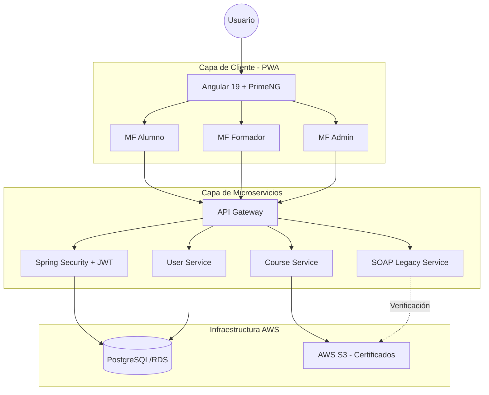

# 🚀 GrowUp - Ecosistema Formativo Inteligente

**GrowUp** es una plataforma digital integral diseñada para impulsar el crecimiento personal y profesional de los usuarios a través de la gestión de aprendizaje, proyectos y progreso individual. Este proyecto representa un entorno de desarrollo **Fullstack real**, integrando arquitectura escalable, tecnologías modernas y una experiencia de usuario fluida.

---

## 📋 Visión y Misión

* **Visión**: Convertirse en un ecosistema formativo inteligente que combine tecnologías modernas (Angular, Spring Boot, AWS, Docker, CI/CD) con una interfaz moderna y despliegue en la nube.
* **Misión**: Facilitar el aprendizaje continuo y la organización profesional mediante una plataforma donde los usuarios planifican su formación, comparten avances y miden su progreso en el tiempo.

---

## 🛠️ Stack Tecnológico

| Área | Tecnología | Descripción |
| :--- | :--- | :--- |
| **Frontend** | **Angular 19** | Interfaz moderna y responsive con TailwindCSS y PrimeNG. |
| **Mobile** | **PWA** | Aplicación Web Progresiva con acceso offline y capacidad de instalación. |
| **Backend** | **Spring Boot** | Arquitectura modular basada en microservicios REST. |
| **Seguridad** | **JWT** | Spring Security con control de acceso basado en roles (RBAC). |
| **Infraestructura** | **Docker & AWS** | Contenedores y despliegue en la nube (S3, RDS, ECS/Beanstalk). |
| **API Doc** | **OpenAPI** | Documentación exhaustiva de endpoints mediante Swagger. |

---

## 🏗️ Arquitectura del Repositorio (Monorepo)

El proyecto está organizado para reflejar una estructura de empresa moderna, facilitando la escalabilidad y el mantenimiento:

* **`/frontend`**: Microfrontends desarrollados en Angular para los distintos roles.
* **`/backend`**: Microservicios especializados (Usuarios, Cursos, Progreso, Notificaciones).
* **`/docs`**: Especificaciones técnicas, manuales y objetivos del proyecto.
* **`/docker`**: Archivos de configuración para la orquestación de contenedores.
* **`/infrastructure`**: Infraestructura como código y pipelines de CI/CD (GitHub Actions).

---

## 👥 Roles de Usuario

* **Alumno**: Crea su perfil, registra cursos, sube proyectos y revisa su progreso.
* **Formador**: Gestiona cursos, materiales y realiza el seguimiento de alumnos inscritos.
* **Administrador**: Controla usuarios, estadísticas y configuraciones globales del sistema.

---

## 🚀 Objetivos Técnicos Clave

* **Pipeline CI/CD**: Implementación de flujo automatizado para construcción, prueba y despliegue en AWS.
* **Almacenamiento Cloud**: Integración con AWS S3 para la gestión de certificados e imágenes.
* **Integración Legacy**: Incorporación de un microservicio SOAP para verificación de certificados.
* **Monitoreo**: Configuración de CloudWatch o Prometheus/Grafana para control de logs y estado del sistema.

---

## 📄 Valor Añadido

GrowUp no es solo una aplicación; es la demostración de dominio del ciclo completo de desarrollo, desde la planificación ágil (Scrum) hasta el mantenimiento y despliegue (DevOps). Está diseñado para evolucionar como un portfolio profesional de alto impacto.

---
*Desarrollado con ❤️ como proyecto integral Fullstack.*

## 🚀 Inicio Rápido

Este es un monorepo. Para trabajar en una parte específica, navega a su directorio:

### Frontend (Angular PWA)
Localizado en `/frontend`.
1. `cd frontend`
2. `npm install`
3. `ng serve -o`

> Consulta el [README de Frontend](./frontend/README.md) para ver la arquitectura detallada de capas y componentes.
